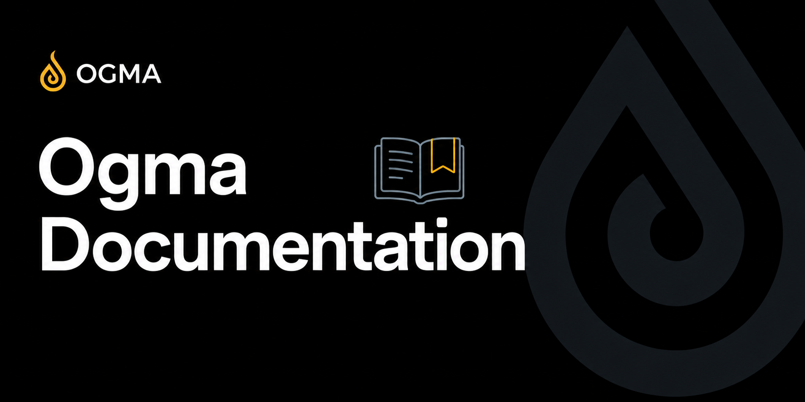

<p align="center">
  <a href="https://github.com/KaijinLab/ogma">
    
  </a>
</p>

<div align="center">

# Ogma Documentation

### Source for [ogma.kaijinlab.com](https://ogma.kaijinlab.com)

<br/>

[](https://github.com/KaijinLab/ogma-docs/actions/workflows/deploy.yml)
[](LICENSE)

<br/>

<a href="https://discord.gg/QNSadmjh6y"></a>
<a href="https://x.com/kaijinlab"></a>

</div>

---

Documentation for [Ogma](https://github.com/KaijinLab/ogma), the open-source local-first web security testing proxy.

Built with [VitePress](https://vitepress.dev).

## Development

```bash
# Install dependencies
pnpm install

# Start local dev server (hot reload)
pnpm dev

# Build for production
pnpm build

# Preview the production build
pnpm preview
```

The dev server runs at `http://localhost:5173` by default.

## Structure

```
.
-- app/           -- Feature documentation (HTTP History, Replay, Automate, etc.)
-- guide/         -- Workflow guides and tutorials
-- reference/     -- Technical reference (HTTPQL, CLI, MCP tools)
-- development/   -- Plugin and extension development
-- plugins/       -- Plugin ecosystem documentation
-- public/        -- Static assets (images, logos)
-- index.md       -- Home page
-- introduction.md
-- getting-started.md
-- .vitepress/    -- VitePress configuration and theme
```

## Contributing

Documentation improvements are welcome.

- Fix a typo or unclear explanation: open a pull request directly
- Add a missing feature page: open an issue first to discuss scope
- Update screenshots: use dark theme at 1440px width

All pages use standard Markdown with VitePress frontmatter. See the [VitePress docs](https://vitepress.dev/guide/markdown) for supported extensions.

## Deployment

Documentation is deployed automatically to [ogma.kaijinlab.com](https://ogma.kaijinlab.com) via GitHub Actions on every push to `master`.

## License

Documentation text is licensed under [CC BY 4.0](LICENSE). Screenshots and images are copyright Kaijin Lab.

The Ogma application itself is licensed under [AGPL-3.0](https://github.com/KaijinLab/ogma/blob/master/LICENSE).
